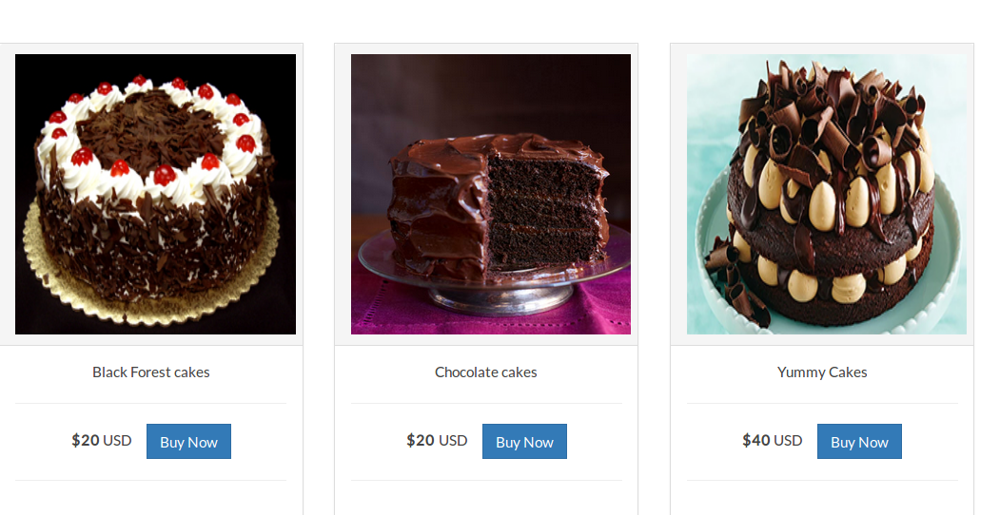

#Cake Shop

An online cake shop built in Flask and JavaScript.

<h3>Requirements</h3>
<ol>
    <li><a href="http://flask.pocoo.org/docs/0.11/installation/"/>Virtual environment</a></li>
    <li><a href="http://flask.pocoo.org/"/>Flask</a></li>
    <li><a href="http://flask-sqlalchemy.pocoo.org/2.1/"/>SQLAlchemy</a></li>
    <li><a href="https://packaging.python.org/installing/"/>Python pip</a></li>
</ol>

<h3>Outlook</h3>

<h3>View all posts</h3>

<h3>Create a new post</h3>

